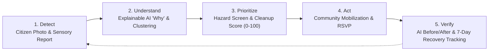
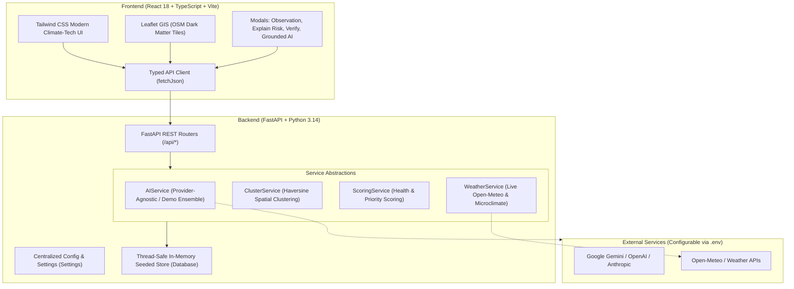

# 🌊 AquaGuardian

### AI-Assisted Urban Freshwater Monitoring and Community Cleanup

> **Detect → Understand → Prioritize → Act → Verify**

AquaGuardian is a web platform that helps people report and monitor the condition of urban freshwater streams.

Users can submit observations, photos, and other information about a stream. The platform uses AI to analyze visible signs such as unusual water appearance, waste, foam, and other environmental indicators. These observations can then be used to identify areas that may need attention and support community cleanup activities.

The goal is to connect **citizen observations, AI-assisted analysis, and community action** in one platform, following a One Health approach.

[](https://fastapi.tiangolo.com)
[](https://react.dev/)
[](https://tailwindcss.com/)
[](https://leafletjs.com/)

---

## Table of Contents

1. [Project Overview](#1-project-overview)
2. [Hackathon Track Alignment](#2-hackathon-track-alignment)
3. [How AquaGuardian Works](#3-how-aquaguardian-works)
4. [System Architecture](#4-system-architecture)
5. [Key Features](#5-key-features)
6. [AI Analysis](#6-ai-analysis)
7. [Responsible AI and Limitations](#7-responsible-ai-and-limitations)
8. [Environment Configuration](#8-environment-configuration)
9. [Local Setup](#9-local-setup)
10. [Project Structure](#10-project-structure)
11. [API Reference](#11-api-reference)
12. [Future Improvements](#12-future-improvements)
---

## 1. Project Overview & Problem Statement

Urban freshwater streams, bayous, and tributaries are among the most vulnerable biomes on earth. They bear the brunt of non-point source stormwater runoff, consumer packaging snags, microplastic fragmentation, and unauthorized industrial discharges.

Traditional municipal monitoring systems suffer from critical bottlenecks:
* **Severe Spatial Latency**: Water samples are collected manually once a month or quarter at fixed stations, missing episodic pulses and localized bank snags.
* **Laboratory Delay**: Chemical assays (BOD, COD, nutrient assays) take days to return laboratory confirmation.
* **Disconnected Community Action**: Citizens observe degradation daily on recreational greenbelts but have no structured channel to trigger action, understand risk drivers, or verify whether cleanups yielded sustained ecological recovery.

### The AquaGuardian Solution
AquaGuardian is **NOT** just another passive dashboard. It operationalizes citizen science by creating a complete closed-loop workflow:
1. **Citizen Science Reporting**: Guided, non-intimidating visual & physical observations (clarity, odor, debris, algae, benthic organisms).
2. **AI Multimodal Evaluation**: Instant diagnostic screening classifying surface anomalies, confidence levels, and human verification recommendations.
3. **Spatial Clustering & Early Warning**: Automated grouping of co-located reports into localized pollution incidents.
4. **Explainable AI ("Why is this stream at risk?")**: Transparent decomposition of health degradation into evidence-backed factors without false certainty.
5. **Community Cleanup Hub & Priority Scoring**: Algorithmic prioritization of safe volunteer interventions vs. hazardous spills that require HAZMAT authorities.
6. **AI Visual Differential Verification**: Before & After photographic comparison quantifying percentage improvement in surface cleanliness.
7. **One Health Synthesis**: Linking freshwater habitat integrity directly to local biodiversity sentinels and human recreational wellbeing.

---

## 2. Hackathon Track Alignment

| Track | Primary Innovation in AquaGuardian |
| :--- | :--- |
| **Track 1 — Citizen Science UX** | Accessible, jargon-free guided observation flow; photo upload with instant AI inference preview and visual indicators. |
| **Track 2 — Data-to-Insight** | Multi-factor Prototype Stream Health Score (0–100) decomposing water clarity, pollution, biodiversity, habitat, and runoff stress. |
| **Track 3 — AI-Supported Assessment** | Multimodal AI vision screening with explicit confidence percentages, evidence citations, and probabilistic uncertainty markers. |
| **Track 5 — Community & Gamification** | Lightweight, purposeful stewardship: Eco Points, observation streaks, and verified badges (*Stream Guardian*, *Cleanup Champion*). |
| **Track 6 — Resilience Informatics** | Spatial & temporal clustering engine (Haversine radius grouping), early warning alerts, and automated cleanup priority calculator. |

---

## 3. Core Lifecycle: The 5-Stage Impact Loop



---

## 4. System Architecture



---

## 5. Key Features

###  1. Multi-Factor Prototype Stream Health Score
Rather than presenting a fake laboratory chemical index, AquaGuardian computes a transparent, weighted prototype score ($0 - 100$):
$$\text{Score} = w_{\text{appearance}} S_{\text{app}} + w_{\text{pollution}} S_{\text{poll}} + w_{\text{biodiversity}} S_{\text{bio}} + w_{\text{habitat}} S_{\text{hab}} + w_{\text{climate}} S_{\text{clim}}$$
Weights are configurable in `backend/app/services/scoring_service.py`.

###  2. Spatial & Temporal Clustering Engine
Groups observations using the Haversine great-circle distance algorithm within a configurable radius ($1.2\text{ km}$) and time window ($72\text{ hours}$). Corroborated clusters trigger automated early warning alerts.

###  3. Cleanup Prioritization Index
Calculated dynamically based on:
* Debris severity & hazard classification
* Clustered report volume & persistence over time
* Estimated affected surface area ($\text{m}^2$)
* Proximity to public recreational greenbelts and parks
* Riparian ecological sensitivity

###  4. Visual Differential Verification
Compares before-and-after imagery to estimate the percentage reduction of surface debris, confirming that physical community effort translated into visible habitat clearing.

###  5. One Health Insights
Examines the interdependent triad between:
* **Freshwater Ecosystem**: Re-aeration, hydraulic snags, turbidity
* **Riparian Biodiversity**: Sentinel bio-indicators (mayfly/dragonfly nymphs)
* **Human Wellbeing**: Heat-island cooling, trail safety, vector mosquito reduction

---

## 6. Provider-Agnostic AI & Demo Mode

The system features an abstraction layer in `backend/app/services/ai_service.py`.

### Configurable AI Providers
The system is ready to connect with any major provider by changing only `.env`:
* `AI_PROVIDER=demo` *(Default)*: Runs locally without network dependencies using a deterministic rule-informed ecological vision ensemble.
* `AI_PROVIDER=google`: Uses Google Gemini (e.g., `gemini-1.5-flash` or `gemini-1.5-pro`).
* `AI_PROVIDER=openai`: Uses OpenAI (e.g., `gpt-4o-mini`).
* `AI_PROVIDER=anthropic`: Uses Anthropic Claude (e.g., `claude-3-haiku`).

### Seamless Fallback
If an external API key is absent, invalid, or hits rate limits, AquaGuardian **never crashes or throws raw errors**. It automatically transitions to Demo Mode with a notification banner.

---

## 7. Responsible AI & Scientific Integrity

AquaGuardian strictly implements responsible AI guidelines:
1. **AI Supports Human Judgment**: The application explicitly emphasizes that computer vision cannot replace certified laboratory water-quality testing or professional environmental authority assessment.
2. **Transparent Uncertainty**: All machine learning outputs are labeled with:
   * `"Potential"`
   * `"Estimated"`
   * `"AI-assisted assessment"`
   * `"Human verification recommended"`
3. **Hazardous Contamination Safeguard**: Observations reporting chemical sheens, industrial solvent odors, or dead aquatic life automatically activate safety protocols that **forbid volunteer citizen entry** and recommend municipal HAZMAT dispatch.
4. **No Unsupported Clinical Claims**: The One Health module strictly describes environmental linkages and avoids claiming water caused specific medical diseases without verified clinical data.

---

## 8. Environment Configuration & API Keys

### Template: `.env.example`
The repository includes `.env.example` with zero hardcoded credentials:

```env
# AI PROVIDER (demo | google | openai | anthropic)
AI_PROVIDER=demo
AI_API_KEY=
AI_MODEL_NAME=

# Optional secondary AI provider
SECONDARY_AI_PROVIDER=
SECONDARY_AI_API_KEY=
SECONDARY_AI_MODEL_NAME=

# Weather API (Optional - Open-Meteo fallback active)
WEATHER_API_KEY=

# Maps / Geolocation (Optional - OpenStreetMap Leaflet active)
MAPS_API_KEY=

# Optional database (In-memory seeded SQLite active by default)
DATABASE_URL=

# Application configuration
APP_ENV=development
API_BASE_URL=http://localhost:8000
```

### Security Enforcement
* `.env` is listed in `.gitignore` and never committed.
* No API keys or tokens are hardcoded anywhere in the codebase.
* The frontend consumes only sanitized status fields via `/api/settings`.

---

## 9. Local Quickstart & Execution Commands

### Prerequisites
* **Python 3.10+** (Tested on Python 3.14)
* **Node.js 18+** and **npm**

### Step 1: Clone and Set Up Environment
```bash
# In project root:
cp .env.example .env
```

### Step 2: Start the Backend (FastAPI)
```bash
# Install backend dependencies
python -m pip install -r backend/requirements.txt

# Start FastAPI server on port 8000
python -m uvicorn backend.app.main:app --host 0.0.0.0 --port 8000 --reload
```
* Backend API will be available at: `http://localhost:8000`
* Interactive OpenAPI Swagger Docs: `http://localhost:8000/docs`

### Step 3: Start the Frontend (Vite + React)
In a second terminal:
```bash
cd frontend
npm install
npm run dev
```
* Frontend web app will be available at: `http://localhost:5173`

### Step 4: Run the Test Suite
```bash
# Run all unit, integration, and E2E scenario tests
python -m pytest backend/tests -v
```

---

## 10. Project Structure

```text
AquaGuardian/
├── .env.example                 # Environment variable template with placeholders
├── .env                         # Local environment file (empty keys, gitignored)
├── .gitignore                   # Ignores credentials, caches, builds, and node_modules
├── README.md                    # Comprehensive documentation and demo guide
│
├── backend/                     # FastAPI Backend Application
│   ├── requirements.txt         # Python dependencies
│   ├── app/
│   │   ├── config.py            # Centralized settings and zero-secret status inspection
│   │   ├── main.py              # Application entry point & CORS configuration
│   │   ├── models/
│   │   │   └── schemas.py       # Pydantic schemas (Stream, Observation, AIAnalysis, etc.)
│   │   ├── services/
│   │   │   ├── ai_service.py    # Provider-independent AI layer with demo fallbacks
│   │   │   ├── cluster_service.py # Spatial Haversine clustering engine
│   │   │   ├── scoring_service.py # Prototype Health & Cleanup Priority calculator
│   │   │   └── weather_service.py # Microclimate runoff abstraction
│   │   ├── data/
│   │   │   ├── seed_data.py     # Realistic 5-stream seeded watershed dataset
│   │   │   └── db.py            # Thread-safe in-memory store with live update capabilities
│   │   └── routers/
│   │       ├── dashboard.py     # GET /api/dashboard
│   │       ├── streams.py       # GET /api/streams, /api/streams/{id}/explain-risk
│   │       ├── observations.py  # GET & POST /api/observations
│   │       ├── ai.py            # POST /api/ai/analyze-observation, /api/ai/query
│   │       ├── alerts.py        # GET /api/alerts, /api/alerts/clusters/spatial
│   │       ├── cleanup.py       # GET & POST /api/cleanup, /api/cleanup/{id}/verify
│   │       ├── impact.py        # GET /api/impact
│   │       ├── insights.py      # GET /api/insights (One Health)
│   │       ├── community.py     # GET /api/community/profile
│   │       └── settings.py      # GET /api/settings
│   └── tests/
│       ├── test_api.py          # API route integration tests
│       ├── test_ai_service.py   # AI inference and scoring unit tests
│       └── test_demo_scenario.py # Complete 10-step hackathon demo flow test
│
└── frontend/                    # Vite + React + TypeScript + Tailwind CSS Frontend
    ├── package.json
    ├── tailwind.config.js       # Custom environmental & health-tech theme
    ├── src/
    │   ├── types/
    │   │   └── index.ts         # TypeScript interfaces matching backend models
    │   ├── services/
    │   │   └── api.ts           # Typed frontend API client
    │   ├── components/
    │   │   ├── Navbar.tsx       # Responsive nav with Eco Points counter & quick CTAs
    │   │   ├── DemoBanner.tsx   # Prominent Demo Mode status indicator
    │   │   ├── StreamMap.tsx    # Leaflet interactive map with custom pins & clusters
    │   │   ├── StreamHealthCard.tsx # Health gauge, indicators, & action triggers
    │   │   ├── ExplainRiskModal.tsx # "Why is this stream at risk?" AI decomposition
    │   │   ├── ObservationModal.tsx # Guided citizen reporting workflow
    │   │   ├── CleanupVerifyModal.tsx # AI before/after photographic verification
    │   │   └── AIAssistantDrawer.tsx # Grounded assistant with evidence citations
    │   ├── pages/
    │   │   ├── DashboardPage.tsx    # High-level watershed KPI dashboard
    │   │   ├── StreamMapPage.tsx    # Full-screen geospatial explorer
    │   │   ├── ObservationsPage.tsx # Citizen observation feed
    │   │   ├── AlertsPage.tsx       # Early warnings & spatial pollution clusters
    │   │   ├── CleanupHubPage.tsx   # Prioritization, RSVP, & action scheduling
    │   │   ├── ImpactPage.tsx       # Closed-loop recovery timeline
    │   │   ├── OneHealthPage.tsx    # Ecosystem + Biodiversity + Wellbeing nexus
    │   │   ├── CommunityPage.tsx    # Badges, streaks, & stewardship leaderboard
    │   │   └── SettingsPage.tsx     # Architecture & provider status
    │   ├── App.tsx              # Root coordinator component
    │   └── main.tsx
```

---

## 11. API Reference

| Method | Endpoint | Description |
| :--- | :--- | :--- |
| `GET` | `/api/health` | Service health and demo status |
| `GET` | `/api/dashboard` | Watershed KPI statistics |
| `GET` | `/api/streams` | List all monitored urban stream reaches |
| `GET` | `/api/streams/{id}` | Detailed stream health card & historical trend |
| `GET` | `/api/streams/{id}/explain-risk` | Explainable AI breakdown: *"Why is this stream at risk?"* |
| `GET` | `/api/observations` | List citizen observations (optional stream filter) |
| `POST` | `/api/observations` | Submit citizen observation with instant AI evaluation |
| `POST` | `/api/ai/analyze-observation` | Standalone multimodal observation assessment |
| `POST` | `/api/ai/compare-cleanup` | AI visual comparison of Before & After cleanup photos |
| `POST` | `/api/ai/query` | Grounded conversational Q&A citing actual database records |
| `GET` | `/api/alerts` | List active early warning alerts |
| `GET` | `/api/alerts/clusters/spatial` | Spatial pollution clusters generated from reports |
| `GET` | `/api/cleanup` | Upcoming, active, and completed cleanup events |
| `POST` | `/api/cleanup` | Schedule new cleanup mobilization |
| `POST` | `/api/cleanup/{id}/join` | Citizen volunteer RSVP (+50 Eco Points) |
| `POST` | `/api/cleanup/{id}/verify` | Submit Before/After photos for AI verification (+100 pts) |
| `GET` | `/api/impact` | Multi-stage intervention recovery timeline records |
| `GET` | `/api/insights` | One Health insights (Ecosystem ⇄ Biodiversity ⇄ Humans) |
| `GET` | `/api/community/profile` | Citizen scientist profile, eco points, badges, and streak |
| `GET` | `/api/settings` | Safe runtime status of configured service providers |

---

## 12. Limitations & Future Roadmap

### Current Prototype Limitations
* **Visual vs. Chemical Screening**: Photographic assessment identifies surface debris, turbidity, and algal films; it cannot replace laboratory chemical testing for dissolved heavy metals or pathogens.
* **Spatial Granularity**: Stream markers currently map to discrete reach centroids rather than dense high-resolution continuous line geometries.
* **Client-Side Image Payloads**: Large image uploads in demo mode rely on URLs or local base64 rather than distributed cloud S3 buckets.

### Future Scope
1. **IoT Sensor Ingestion**: Real-time integration with low-cost turbidity, pH, and dissolved oxygen probes (e.g. Arduino / ESP32 mesh networks).
2. **Sentinel-2 Satellite Layer**: Correlating citizen riverbank observations with satellite spectral indices (NDWI, Chlorophyll-a).
3. **Municipal Work Order Dispatch**: Automated webhook integration with city 311 systems for hazardous spill responses.
4. **Micro-Volunteering PWA**: Offline Progressive Web App with geolocation caching for stream surveys without cellular connectivity.

---
